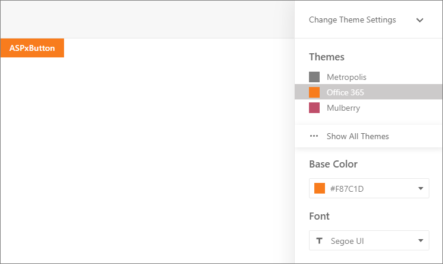

<!-- default badges list -->

[](https://supportcenter.devexpress.com/ticket/details/T590818)
[](https://docs.devexpress.com/GeneralInformation/403183)
<!-- default badges end -->
# ASP.NET Web Forms Controls - How to implement the Theme Selector control shown in DevExpress Demos
<!-- run online -->
**[[Run Online]](https://codecentral.devexpress.com/134106079/)**
<!-- run online end -->

This example demonstrates how to implement the Theme Selector control as shown in [ASP.NET Web Forms Demos](https://demos.devexpress.com/ASP/). 



## Overview

Follow the steps below to implement a theme selector:

1. Copy files from the folders listed below to the corresponding folders in your application.

    * [App_Code](./CS/App_Code)
    * [App_Data](./CS/App_Data)
    * [Scripts](./CS/Scripts)
    * [Styles](./CS/Styles)
    * [UserControl](./CS/UserControl)

2. Register **ThemeSelector** and **ThemeParametersSelector** controls in the *web.config* file:

   ```aspx
   <pages>
     <controls>
       <!-- ... -->
       <add src="~/UserControl/ThemeParametersSelector.ascx" tagName="ThemeParametersSelector" tagPrefix="dx" />
       <add src="~/UserControl/ThemeSelector.ascx" tagName="ThemeSelector" tagPrefix="dx" />
     </controls>
   </pages>
   ```

3. Once a user selects a theme, the code example writes that theme to cookies [writes to cookies???]. To apply this theme, handle the `Application.PreRequestHandlerExecute` event in the *Global.asax* file as follows:

   ```cs
   protected void Application_PreRequestHandlerExecute(object sender, EventArgs e) {
       DevExpress.Web.ASPxWebControl.GlobalTheme = Utils.CurrentTheme;
       Utils.ResolveThemeParametes();
   }
   ```

4. In the [master page](./CS/MasterPage.master), add **ThemeSelector** and **ThemeParametersSelector** controls as follows:

   ```aspx
   <form id="form1" runat="server">
       <header>
           <dx:ASPxPanel runat="server" ClientInstanceName="TopPanel" CssClass="header-panel" FixedPosition="WindowTop" EnableTheming="false">
               <PanelCollection>
                   <dx:PanelContent>
                       <a class="right-button icon cog right-button-toggle-themes-panel" href="javascript:void(0)" onclick="DXDemo.toggleThemeSettingsPanel(); return false;"></a>
                   </dx:PanelContent>
               </PanelCollection>
           </dx:ASPxPanel>
       </header>
       <div class="main-content-wrapper">
           <section class="top-panel clearfix top-panel-dark">
               <dx:ASPxButton runat="server" Text="Change Theme Settings" CssClass="theme-settings-menu-button adaptive"
                   EnableTheming="false" AutoPostBack="false" ImagePosition="Right" UseSubmitBehavior="false">
                   <Image SpriteProperties-CssClass="icon angle-down theme-settings-menu-button-image" />
                   <FocusRectBorder BorderWidth="0" />
                   <ClientSideEvents Click="DXDemo.toggleThemeSettingsPanel" />
               </dx:ASPxButton>
           </section>
           <dx:ASPxPanel runat="server" ClientInstanceName="ThemeSettingsPanel" CssClass="theme-settings-panel"
               FixedPosition="WindowRight" Collapsible="true" EnableTheming="false" ScrollBars="Auto">
               <SettingsCollapsing AnimationType="Slide" ExpandEffect="PopupToLeft" ExpandButton-Visible="false" />
               <Styles>
                   <ExpandBar Width="0" />
                   <ExpandedPanel CssClass="theme-settings-panel-expanded"></ExpandedPanel>
               </Styles>
               <PanelCollection>
                   <dx:PanelContent>
                       <div class="top-panel top-panel-dark clearfix">
                           <dx:ASPxButton runat="server" Text="Change Theme Settings" CssClass="theme-settings-menu-button"
                               EnableTheming="false" AutoPostBack="false" ImagePosition="Right" HorizontalAlign="Left" UseSubmitBehavior="false">
                               <Image SpriteProperties-CssClass="icon angle-down theme-settings-menu-button-image" />
                               <FocusRectBorder BorderWidth="0" />
                               <ClientSideEvents Click="DXDemo.toggleThemeSettingsPanel" />
                           </dx:ASPxButton>
                       </div>
                       <div class="theme-settings-panel-content">
                           <dx:ThemeSelector ID="ThemeSelector" runat="server" />
                           <% if(Utils.CanApplyThemeParameters) { %>
                           <dx:ThemeParametersSelector ID="ThemeParametersSelector" runat="server" />
                           <% } %>
                       </div>
                   </dx:PanelContent>
               </PanelCollection>
           </dx:ASPxPanel>
       </div>
       <div style="clear: both;">
           <asp:ContentPlaceHolder ID="ContentPlaceHolder1" runat="server">
           </asp:ContentPlaceHolder>
       </div>
   </form>
   ```

## Files to Review
* [ThemeGroupModel.cs](./CS/App_Code/ThemeGroupModel.cs) (VB: [ThemeGroupModel.vb](./VB/App_Code/ThemeGroupModel.vb))
* [ThemeModel.cs](./CS/App_Code/ThemeModel.cs) (VB: [ThemeModel.vb](./VB/App_Code/ThemeModel.vb))
* [ThemeModelBase.cs](./CS/App_Code/ThemeModelBase.cs) (VB: [ThemeModelBase.vb](./VB/App_Code/ThemeModelBase.vb))
* [ThemesModel.cs](./CS/App_Code/ThemesModel.cs) (VB: [ThemesModel.vb](./VB/App_Code/ThemesModel.vb))
* [Utils.cs](./CS/App_Code/Utils.cs) (VB: [Utils.vb](./VB/App_Code/Utils.vb))
* [Default.aspx](./CS/Default.aspx) (VB: [Default.aspx](./VB/Default.aspx))
* [Default.aspx.cs](./CS/Default.aspx.cs) (VB: [Default.aspx.vb](./VB/Default.aspx.vb))
* [Global.asax](./CS/Global.asax) (VB: [Global.asax](./VB/Global.asax))
* [MasterPage.master.cs](./CS/MasterPage.master.cs) (VB: [MasterPage.master.vb](./VB/MasterPage.master.vb))
* [Script.js](./CS/Scripts/Script.js) (VB: [Script.js](./VB/Scripts/Script.js))
* [ThemeParametersSelector.ascx](./CS/UserControl/ThemeParametersSelector.ascx) (VB: [ThemeParametersSelector.ascx](./VB/UserControl/ThemeParametersSelector.ascx))
* [ThemeParametersSelector.ascx.cs](./CS/UserControl/ThemeParametersSelector.ascx.cs) (VB: [ThemeParametersSelector.ascx.vb](./VB/UserControl/ThemeParametersSelector.ascx.vb))
* [ThemeSelector.ascx](./CS/UserControl/ThemeSelector.ascx) (VB: [ThemeSelector.ascx](./VB/UserControl/ThemeSelector.ascx))
* [ThemeSelector.ascx.cs](./CS/UserControl/ThemeSelector.ascx.cs) (VB: [ThemeSelector.ascx.vb](./VB/UserControl/ThemeSelector.ascx.vb))

## More Examples

* [How to implement the Theme Selector control shown in the DevExpress Demo (Old Style)](https://github.com/DevExpress-Examples/how-to-implement-a-theme-selector-control-similar-to-devexpress-demo-old-style-t504407)


